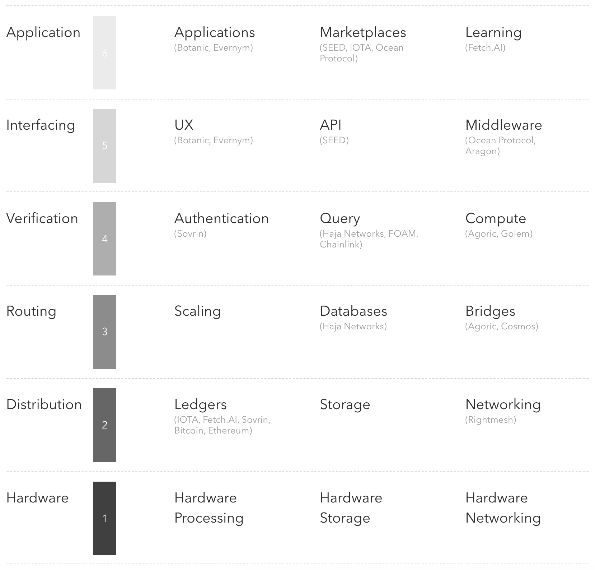

# Convergence Stack Nodes

Node launchers and [wiki](https://github.com/OutlierVentures/Convergence-Stack-Nodes/wiki) for the Convergence Stack. Pull requests welcome.

## Launching nodes

Requirements: Linux/MacOS and Docker. The Fetch.AI ledger node does not even require Docker.

To start a node, just run the relevant script.

To stop a node, run the stop script.

In some cases you may get an 'incorrect username or password' error, in which case you just need to login your Docker client: `docker login --username [USERNAME]`.
